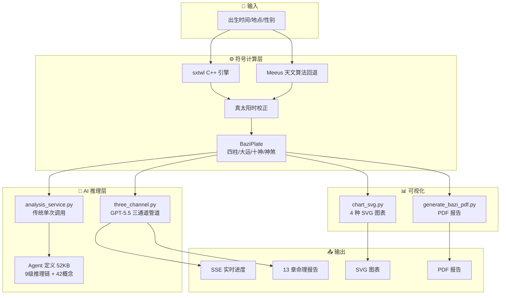
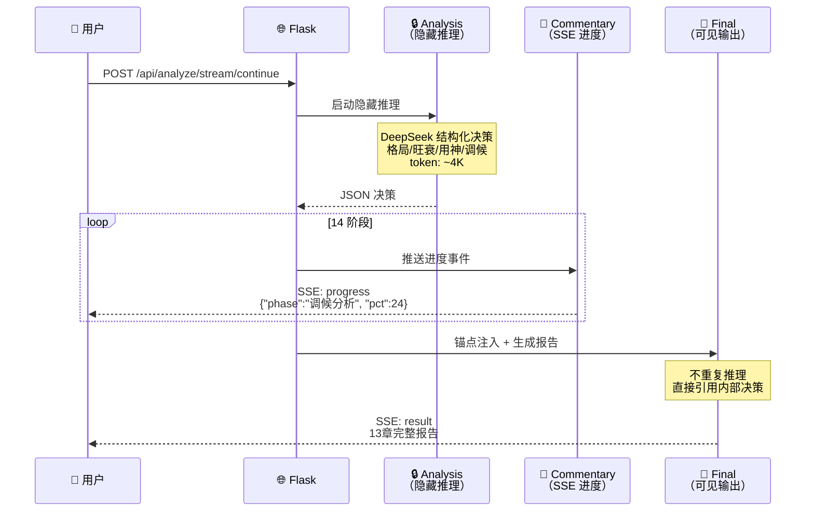

<div align="center">

# 🏯 八字排盘 · AI 命理分析

**符号计算 + LLM 推理的混合 AI 架构**

[](https://python.org)
[](https://flask.palletsprojects.com/)
[](https://deepseek.com)
[](LICENSE)
[](https://thewher.pythonanywhere.com)

</div>

---

## ✨ 亮点

<table>
<tr>
<td width="50%">

### 🔮 精准排盘
- sxtwl C++ 库 + Meeus 天文算法双引擎
- 真太阳时自动校正
- 四柱/大运/十神/神煞/空亡/藏干 一键计算
- 24 条测试用例全覆盖

### 🧠 AI 深度分析
- 梁湘润体系 9 级递进推理链
- 42 个核心概念（23 个标注经典出处）
- 11 条盲测发现错误模式防御
- 极端度分流验盘策略

</td>
<td width="50%">

### 🎯 验盘闭环
- Agent 反推过去事件 → 用户确认 → 正式批断
- 双采样自一致性验证
- 用户纠正最高优先级注入
- 反馈标注积累 → 持续优化

### 📊 可视化报告
- 五行环图 / 十二长生轮盘
- 大运时间轴 / 环形大运图（当前步高亮）
- 干支关系图 / 术语学堂
- 浏览器打印 PDF 报告

</td>
</tr>
</table>

---

## ⚡ 快速开始

```bash
pip install -r requirements.txt
python app.py          # → http://localhost:5000
```

配置 API Key（三选一）：

```python
# config.local.py（不提交 Git）
API_CONFIG = {
    "base_url": "https://api.deepseek.com/anthropic",
    "model": "deepseek-v4-pro[1m]",
    "api_key": "sk-...",
}
WEB_PASSWORD = "your-password"  # 可选，保护深度分析
```

```bash
# 测试
python test_paipan.py              # 24 条全量
python test_paipan.py --verbose    # 详细输出
python test_paipan.py --smoke      # 5 条冒烟
```

---

## 🏗️ 架构



### 🔬 三通道管道（GPT-5.5 参考实现）

> 2026 年 GPT-5.5 系统提示词泄露揭示了三层输出通道设计。本项目将其迁移到八字分析管道。



| 通道 | 可见性 | 内容 | Token |
|:---:|:---:|---|:---:|
| 🔒 **analysis** | 隐藏 | 结构化决策 JSON（格局/旺衰/用神/调候/病药/流年信号） | ~4K |
| 📡 **commentary** | SSE 流 | 14 阶段分析进度实时推送 | 极低 |
| 📝 **final** | 可见 | 13 章完整命理报告，直接引用决策不重复推理 | ~24K |

**SSE 事件流**：`stage` → `progress`(×14) → `analysis_complete` → `complete` → `result`

---

## 📡 API

| 路由 | 方法 | 说明 |
|------|:---:|------|
| `/api/paipan` | POST | 八字排盘 |
| `/api/geocode?q=` | GET | 地名 → 经纬度 |
| `/api/cities?q=` | GET | 城市模糊搜索 |
| `/api/analyze` | POST | AI 深度分析（验盘阶段） |
| `/api/analyze/stream` | POST | 🔥 三通道 SSE 流式验盘 |
| `/api/analyze/continue` | POST | 多轮对话续接（正式批断） |
| `/api/analyze/stream/continue` | POST | 🔥 三通道 SSE 流式续接 |
| `/api/chart/wuxing` | POST | 五行环图 SVG |
| `/api/chart/changsheng` | POST | 十二长生轮盘 SVG |
| `/api/chart/dayun` | POST | 大运时间轴 SVG |
| `/api/chart/dayun-ring` | POST | 大运环图 SVG |
| `/api/verify` | POST | 验盘反馈保存 |
| `/api/pdf` | POST | PDF 报告 |

---

## 🛠️ 技术栈

| 层 | 技术 |
|:---:|---|
| **后端** | `Flask` `fpdf2` `requests` `zhdate` |
| **前端** | 原生 JS · 零框架 · 桌面分栏 · 移动端自适应 |
| **AI** | `DeepSeek v4-pro[1m]` · Anthropic 兼容端点 · 52KB 系统提示词 |
| **部署** | PythonAnywhere · Render 备用 |

---

## 📈 验盘性能

```
13 人盲测结果：
  极端度 3（极端命局）:  ████████████████████ 100%
  极端度 2:              ████████████████      78%
  极端度 1:              ████████              38%
  极端度 0（均衡命局）:   ░░░░░░░░░░░░░░░░░░░░   0%

  时间型预测命中率: 92%    特征型预测命中率: 38%
```

---

## 📄 许可证

MIT © TheWher
