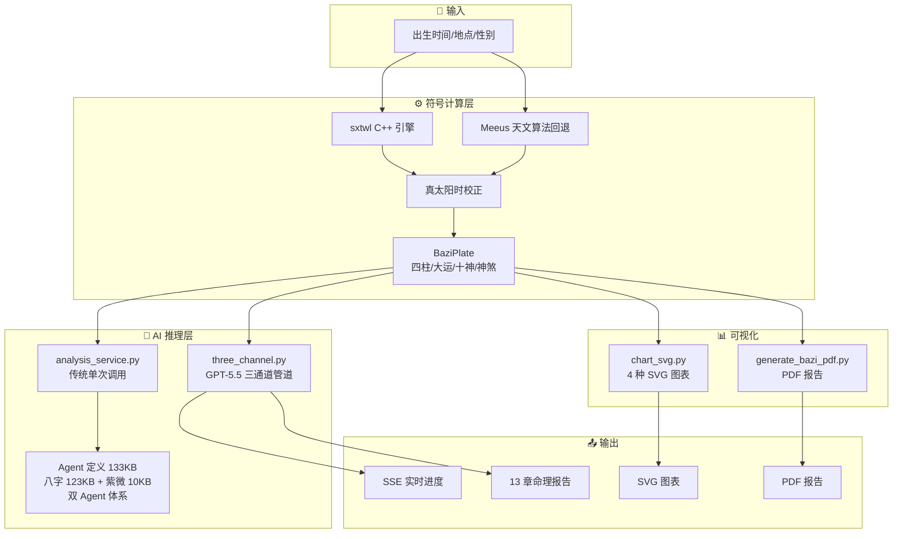
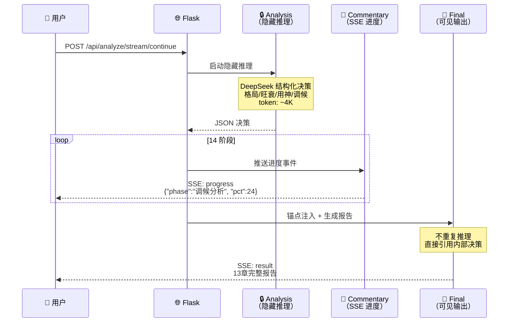

<div align="center">

# 🏯 八字 & 紫微 · AI 命理分析

**符号计算 + LLM 推理的混合 AI 架构 · 双术数系统**

[](https://python.org)
[](https://flask.palletsprojects.com/)
[](https://deepseek.com)
[](https://pypi.org/project/iztro-py/)
[](LICENSE)
[](https://thewher.pythonanywhere.com)

</div>

---

## ✨ 亮点

<table>
<tr>
<td width="50%">

### 🔮 精准排盘
- sxtwl C++ 库 + Meeus 天文算法双引擎
- 真太阳时自动校正
- 四柱/大运/十神/神煞/空亡/藏干 一键计算
- 24 条测试用例全覆盖

### 🧠 AI 深度分析
- 梁湘润体系 9 级递进推理链
- 42 个核心概念 · 13 条盲测错误模式防御
- 双模式分流验盘（极端冲合信号 / 均衡大运主题确认）
- 🆕 紫微 Agent v5：8 步推理链 · 四层四化权重 · 8 格局核验 · 风险过滤

</td>
<td width="50%">

### 🎯 验盘闭环
- 盲测驱动迭代：极端 100%，均衡 71%（从 0% 突破）
- stop_sequences 截停 + 后处理硬校验，零成本防幻觉
- 反馈标注积累 → 持续优化
- 7 领域结构化 JSON 知识库，LLM prompt 注入量降低 80%+

### 📊 可视化 & 交互
- 五行环图 / 十二长生轮盘 / 大运环形图
- **🔮 紫微十二宫 Grid**（文墨天机风格）
- 排盘确认步骤 + 三态粘性操作栏
- 逐字段行内验证 + 古籍引用 tooltip
- 浏览器打印 PDF 报告

</td>
</tr>
<tr>
<td width="50%">

### 🔮 紫微斗数（2026-07 新增，v7 Agent）
- iztro-py 排盘引擎 · 后端 `_BRIGHTNESS_FIX` 全量修正（令东来参考表）
- **10 步推理链**（含亮度自检）· **四层四化权重**（15 条互涉）
- **身宫框架**（4 维+4 段权重+命身同宫）· **对宫冲照**（6 组+7 级力度）
- **24 格局三列核验**（必要条件+条件受损+吉化加分）· **破格五层穿透**（打到核心？+能否补救？）
- **对星组合** + 禄存专项（羊陀夹制/被破）· 截空旬空 · 空宫借星 7 场景
- **多轮纯文本**（禁 markdown）· 桃花/化权夫妻宫专项话术 · 超出范围标准回复

</td>
<td width="50%">

### 🗂️ 双系统架构
- Landing 页双按钮分流（八字 `/app` · 紫微 `/ziwei`）
- 独立页面 + 共享表单输入复用出生信息
- **紫微数据管道 v4**：GAN_SIHUA 对照表注入 → 大限四化表+流年数据引擎预计算 → 亮度字段+身宫标记
- 9+5 JSON 知识库 + 24 条八字测试 + 50 条紫微测试

</td>
</tr>
</table>

---

## ⚡ 快速开始

```bash
pip install -r requirements.txt
python app.py          # → http://localhost:5000
```

配置 API Key（三选一）：

```python
# config.local.py（不提交 Git）
API_CONFIG = {
    "base_url": "https://api.deepseek.com/anthropic",
    "model": "deepseek-v4-pro[1m]",
    "api_key": "sk-...",
}
WEB_PASSWORD = "your-password"  # 可选，保护深度分析
```

```bash
# 测试
python test_paipan.py              # 24 条全量
python test_paipan.py --verbose    # 详细输出
python test_paipan.py --smoke      # 5 条冒烟
python blind_test_balanced.py      # 均衡命局专项盲测
python test_ziwei.py               # 紫微 50 条全量
```

---

## 🏗️ 架构



### 🔬 三通道管道（GPT-5.5 参考实现）

> 2026 年 GPT-5.5 系统提示词泄露揭示了三层输出通道设计。本项目将其迁移到八字分析管道。



| 通道 | 可见性 | 内容 | Token |
|:---:|:---:|---|:---:|
| 🔒 **analysis** | 隐藏 | 结构化决策 JSON（格局/旺衰/用神/调候/病药/流年信号） | ~4K |
| 📡 **commentary** | SSE 流 | 14 阶段分析进度实时推送 | 极低 |
| 📝 **final** | 可见 | 13 章完整命理报告，直接引用决策不重复推理 | ~24K |

**SSE 事件流**：`stage` → `progress`(×14) → `analysis_complete` → `complete` → `result`

---

## 📡 API

| 路由 | 方法 | 说明 |
|------|:---:|------|
| `/api/paipan` | POST | 八字排盘 |
| `/api/geocode?q=` | GET | 地名 → 经纬度 |
| `/api/cities?q=` | GET | 城市模糊搜索 |
| `/api/analyze` | POST | AI 深度分析（验盘阶段） |
| `/api/analyze/stream` | POST | 🔥 三通道 SSE 流式验盘 |
| `/api/analyze/continue` | POST | 多轮对话续接（正式批断） |
| `/api/analyze/stream/continue` | POST | 🔥 三通道 SSE 流式续接 |
| `/api/chart/wuxing` | POST | 五行环图 SVG |
| `/api/chart/changsheng` | POST | 十二长生轮盘 SVG |
| `/api/chart/dayun` | POST | 大运时间轴 SVG |
| `/api/chart/dayun-ring` | POST | 大运环图 SVG |
| `/api/glossary/lookup?term=` | GET | 术语词典查询（44 条） |
| `/api/glossary/references` | GET | 古籍引用（表单 tooltip） |
| `/api/verify` | POST | 验盘反馈保存 |
| `/api/pdf` | POST | PDF 报告 |
| `/api/feedback/list` | GET | 反馈日志列表 |
| `/api/ziwei/paipan` | POST | 🔮 紫微斗数排盘（iztro-py 引擎） |
| `/api/ziwei/analyze` | POST | 🔮 紫微全盘 AI 解读（数据契约含5源：十二宫+生年四化+大限四化+当前大限+流年） |
| `/api/ziwei/analyze/yearly` | POST | 🔮 紫微流年聚焦解读（三层叠盘） |
| `/api/ziwei/horoscope` | POST | 🔮 紫微流年盘 + 流曜计算 |

---

## 🛠️ 技术栈

| 层 | 技术 |
|:---:|---|
| **后端** | `Flask` `fpdf2` `requests` `zhdate` `iztro-py` |
| **前端** | 原生 JS · 零框架 · 桌面分栏 · 移动端自适应 |
| **AI** | `DeepSeek v4-pro[1m]` · Anthropic 兼容端点 · 八字 Agent (123KB) + 紫微 Agent v5 (10KB) |
| **排盘** | sxtwl C++ (八字) · Meeus 回退 · iztro-py (紫微) |
| **部署** | PythonAnywhere · Render 备用 |

---

## 📈 验盘性能

```
极端命局（spread ≥ 3，冲合信号法）：
  郎朗 / 姚明 / 邓小平 / 毛泽东 / 蒋介石 / 张艺谋    100% (6/6)

略偏命局（spread = 2，冲合信号法）：
  林青霞 / 成龙 / 科比 等                              78% (7/9)

均衡命局（spread ≤ 2，十神到位 → 大运降级）：
  王菲 / 李娜 / 马云                                   71% (5/7)
  （2026-07-13 突破：从冲合信号法的 0% 提升至大运主题确认的 71%）

  时间型预测命中率: 92%    特征型预测命中率: 38%
```

> **均衡命局结论**：十神首现全在童年（≤8 岁），流年级时间信号理论上不存在——不是方法问题，是信息论上限。降级为大运主题确认后命中率达 71%。

---

## 📄 许可证

MIT © TheWher
